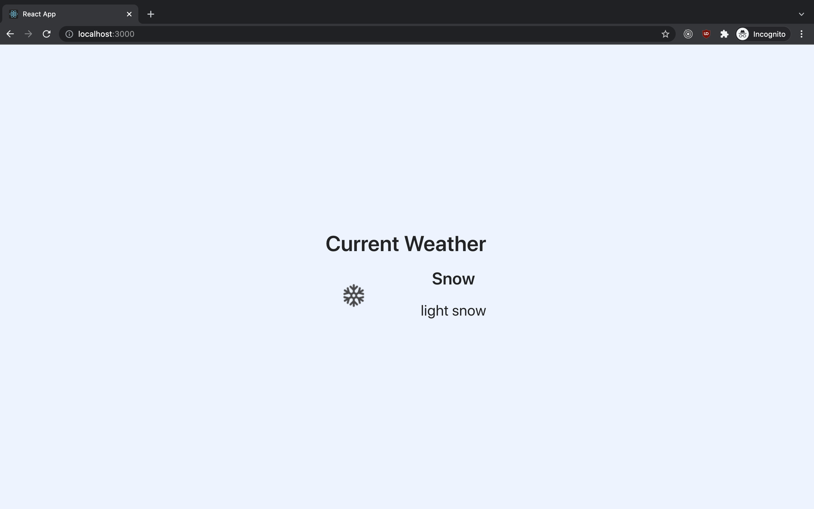
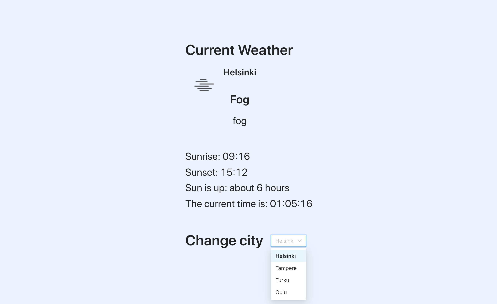

# Aatos Coding Challennge

## Prerequisites

* An [openweathermap](http://openweathermap.org/) API key.

Create an account to openweathermap.org (it's free) and create an API key. Create a file called `.env.development.local` in the root directory

with the following content (add your own api key)

```
REACT_APP_API_KEY=your-api-key-here
```

You may read more about the usage of `.env.development.local` from [here](https://create-react-app.dev/docs/adding-custom-environment-variables/) if interested, but basically it allows you to create environment variables that are evaluated and embedded at the build time (i.e. when you run `yarn start`).


## The Challenge

### 1. Make it compile

Something seems of... Find what is causing the application to crash on start

### 2. Where's the data?

At the moment there's no data to show. Use the provided `getWeatherFromApi` function and fetch the weather data when the `Weather` component is mounnted the first time.

### 3. Add some columns

We'll be using a design system called Antd Design. Use Ant Design's Grid system to modify the view to show data in two columns (example below)

Hints:
* [Ant Design Documentation]<https://ant.design/components/overview/>




### 4. WeatherDataSection deserves it's own file

WeatherDataSection deserves it's own file: Move the component to a new file and import it from there.


### 5. Possibility select the city

At the moment we're always getting the current Weather data for Helsinki. Add a way for the user to select a city from the following options:

* Helsinki
* Tampere
* Turku
* Oulu

The weather data should automatically be updated with the data for the chosen city

Also, the chosen city should be passed to the WeatherDataSection component as a prop and it should show the city name.

### 6. Sunrise and sunset

The same api call that we use to get the current weather also gives us information regarding sunset and sunrise. Using this data, create a new component that informs the user what time the sunsets and rises, and how long the day is ( i.e. difference between sunset and sunrise, you can decide how precise you'd like to show this information). You may use an external npm library to date/time calculations (for example: [date-fns](https://date-fns.org/)).

Hint: The api returns the sunrise and sunset data in unix time. In order to convert it to a Javascript Date object you need to multiply it with 1000 e.g. `new Date(sunrise * 1000)`;


### 7. Create a digital clock

Add a "digital clock" that informs the user what date and time it is at the moment. Time should include seconds. The clock should update automatically when the time passes.


## The final result

The final result should look something like this



Feel free to make it prettier than the example if you want :)

## Available Scripts

In the project directory, you can run:

### `yarn start`

Runs the app in the development mode.\
Open [http://localhost:3000](http://localhost:3000) to view it in the browser.

The page will reload if you make edits.\
You will also see any lint errors in the console.
